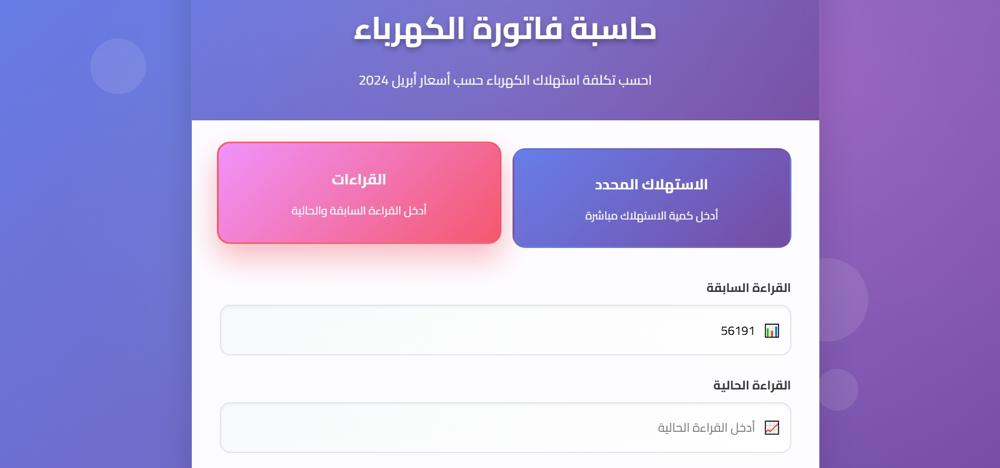

# حاسبة فاتورة الكهرباء (Electricity Bill Calculator)

A web application for calculating electricity bills according to Egypt's April 2024 tariffs. The calculator is fully bilingual (Arabic/English) and offers various export options.

## Features

- Calculate electricity costs by entering specific consumption or meter readings
- View detailed breakdown of costs
- Track environmental impact
- Calculate potential savings
- Save calculation history
- Multi-language support (Arabic and English)
- Dark/Light theme toggle
- Export bills as PDF
- Export calculation history as PDF or Excel
- Dynamic date updates in appropriate locale format

## Technologies Used

- HTML5
- CSS3
- JavaScript (Vanilla)
- Chart.js for consumption visualization
- jsPDF and HTML2Canvas for PDF generation
- SheetJS for Excel export

## Live Demo

Visit the live application: [Electricity Bill Calculator](https://gemy04.github.io/electricity-bill-calculator/)

## How to Use

1. Choose your preferred language (Arabic or English)
2. Select your calculation method (specific consumption or meter readings)
3. Enter your consumption details
4. Click "Calculate" to see your bill breakdown
5. Use the savings calculator to see how much you could save
6. Export your bill or history as needed
7. Toggle between light and dark themes as preferred

## Screenshots

### Screenshot 1

### Screenshot 2
